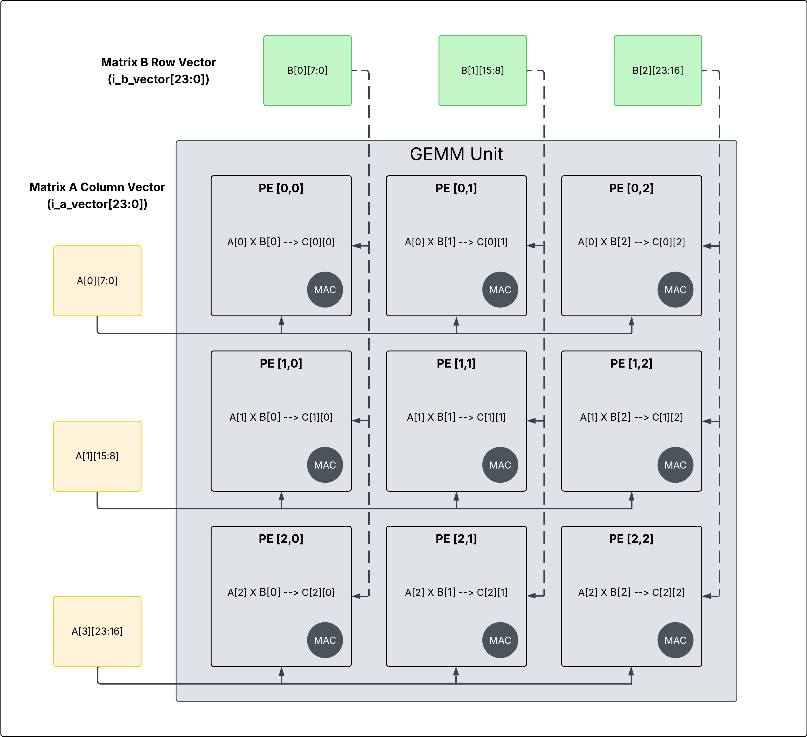

# GEMM Core Engine
This project is part of a coding challenge to create an accelerator for some AI/ML workload or algorithm. What I've designed here are two prototypes for a parallel broadcast array. One for 8-bit floating point, and one for 8-bit integer operations. Below is a introduction to the floating point format I used. If you want more context into the project please visit the accompanying [wiki](https://github.com/reecewayt/llm-assisted-design-portfolio/wiki) I wrote; you will find a design comparison there as well. The work load I set to accelerate here are CNNs, but this project focuses solely on the processing array (i.e. GEMM) with the assumption that a img2column transformation is applied to an input feature map. See my notes below on this transformation.

> **Note**: I use the terms GEMM and processing array interchangably. The array I've designed is different than what is typically used in GEMMs. GEMMs use systolic arrays, but I've implemented a parallel broadcasting array. In a systolic architecture, processing elements (PEs) receive inputs from neighboring cells. In my architecture, input vectors are broadcasted to all PEs at once. A single PE consist of a 8-bit multiply and 32-bit accumulate logic. Values from each PE are collected together and put in a local buffer. Intermediate results do not flow between neighboring cells like that seen in systolic architectures.




## Requirements

### Software Dependencies

The modules in this project require the following software:

- **Python 3.8+** - Core development language
- **MyHDL** - Hardware description in Python
- **OpenLane 2** - ASIC synthesis and place-and-route flow
- **GTKWave** - Waveform viewer for VCD files

### Hardware Synthesis Tools

- **OpenLane 2** - Complete RTL-to-GDSII flow
  - Includes Yosys, OpenROAD, Magic, and other open-source tools
  - Installation guide: [OpenLane 2 Documentation](https://openlane2.readthedocs.io/)

### Install Python Dependencies

```bash
python -m venv venv
source venv/bin/activate
pip install -r requirements.txt
```

### Install GTKWave

**Ubuntu/Debian:**
```bash
sudo apt-get install gtkwave
```

**macOS:**
```bash
brew install gtkwave
```

**Windows:**
Download from [GTKWave website](http://gtkwave.sourceforge.net/)

## Test Runner Utility

This project includes a comprehensive test runner utility (`tests/utils/hdl_test_utils.py`) that simplifies hardware testing and debugging:

### Features

- **Automated Unit Testing**: Run HDL module tests with proper setup/teardown
- **VCD Generation**: Automatically generate waveform files for signal analysis
- **Verilog Output**: Convert MyHDL designs to Verilog
- **Organized Output**: Automatically organizes files by component and test name

### Usage

```python
from tests.utils.hdl_test_utils import test_runner

# Run a test with VCD and Verilog generation
self.sim = test_runner(
    self.create_fp8_processing_array,    # DUT creation function
    lambda: test_sequence,               # Test stimulus generator
    clk=self.clk,                       # Clock signal
    period=10,                          # Clock period
    dut_name="fp8_processing_array",    # Name for output files
    vcd_output=True,                    # Generate VCD for GTKWave
    verilog_output=True,                # Generate Verilog
    duration=2000                       # Simulation duration
)
```

### Running Tests

```bash
# Run individual test with VCD generation
python tests/unit/test_fp8_parallel_array.py

# View generated waveforms
gtkwave vcd/fp8processingarray/fp8_processing_array_testMatrixMultiplication.vcd

# Generated Verilog files are in:
ls gen/verilog/
```

## Synthesized Designs

This project contains two main synthesized designs ready for ASIC implementation:

### 1. FP8 E4M3 Processing Array (2x2)
- **Location**: `src/hdl/components/fp8_processing_array.py`
- **Format**: 8-bit E4M3 floating-point (1 sign, 4 exponent, 3 mantissa)
- **Configuration**: `openlane2/fp_parallel_processor_array/config.json`
- **Features**:
  - Pipelined floating-point MAC units
  - IEEE 754-style rounding and normalization
  - Special case handling (NaN, overflow, underflow)
  - Parallel matrix multiplication

### 2. Integer Processing Array (3x3)
- **Location**: `src/hdl/components/processing_array_3x3.py`
- **Format**: 8-bit signed integer with 32-bit accumulation
- **Configuration**: `openlane2/int_parallel_processing_array_3x3/config.json`
- **Features**:
  - High-throughput integer MAC operations
  - Overflow detection and saturation
  - Scalable to larger array sizes

## Synthesis with OpenLane 2

### Prerequisites

1. Install OpenLane 2 following the [official documentation](https://openlane2.readthedocs.io/)
2. Generate Verilog files using the test runner or conversion scripts

### Generate Verilog

```bash
# Generate Verilog for FP8 array
python tests/unit/test_fp8_parallel_array.py

# Generate Verilog for integer array
python tests/unit/test_parallel_array_3x3.py
```

### Synthesize FP8 Processing Array

```bash
cd openlane2/fp_parallel_processor_array

# Run synthesis, place and route
openlane2 config.json
```

### Synthesize Integer Processing Array

```bash
cd openlane2/int_parallel_processing_array_3x3

# Run synthesis with specific die area constraints
openlane2 config.json
```

### Project Structure

```bash
cnn-accelerator/
├── src/
│   ├── hdl/                  # MyHDL source code
│   │   └── components/       # Design code
│   └── utils/                # Helper functions
├── gen/                      # Generated Verilog/VHDL files
│   └── verilog/              # Generated Verilog output
├── tests/                    # Test files
│   ├── unit/                 # Unit tests for individual components
│   └── integration/          # Full system tests
├── docs/                     # Documentation
├── scripts/                  # Build scripts, automation
├── venv/                     # Virtual environment (gitignored)
├── requirements.txt          # Dependencies
└── README.md                 # Project documentation
```

## Mathematical Background

### Floating Point [E4M3](https://docs.nvidia.com/deeplearning/transformer-engine/user-guide/examples/fp8_primer.html) Representation
E4M3 is an 8-bit floating point format designed for low-precision machine learning applications. It consists of:
```
[S|EEEE|MMM]
 ↑  ↑    ↑
 |  |    └── Mantissa (3 bits)
 |  └─────── Exponent (4 bits, bias of 7)
 └────────── Sign (1 bit)
```
**Mathematical Representation**
For a given bit pattern `[S|EEEE|MMM]`, the value is calculated as:

$$v = (-1)^S \times (1 + M) \times 2^{(E-7)}$$

Where:
- $S$ is the sign bit (0 for positive, 1 for negative)
- $E$ is the unsigned integer value of the exponent bits
- $M$ is the fraction value of the mantissa bits (interpreted as 0.MMM)
- The bias for E4M3 is 7

**Example Calculation**
For the bit pattern `00101101` representing 0.40625:

- Sign bit ($S$): 0 (positive)
- Exponent bits ($E$): 0101 = 5 in decimal
- Mantissa bits ($M$): .101 = 0.625 in decimal (0.5 + 0.125)

Applying the formula:
$$v = (-1)^0 \times (1 + 0.625) \times 2^{(5-7)}$$
$$v = 1 \times 1.625 \times 2^{-2}$$
$$v = 1.625 \times 0.25$$
$$v = 0.40625$$

This value (0.40625) is the closest representable number to 0.3952 in the E4M3 format due to the limited precision.

**Special Cases:**
E4M3 format allows one special format which is when the exponent bits are all 1's; this represents `NaN`.

**Precision Limitations**
With only 3 bits for the mantissa, E4M3 can only represent 8 different fraction values per exponent, making it suitable for applications where memory efficiency is more important than high precision.

### Floating Point Multiplication
This project includes a FP MAC unit and FP Parallel Processing Unit. Below is the description for multiplication and addition that is at the heart of this design. Remember we are using the E4M3 format.

1. Handle special cases (NaN or Zero):
       - If either input is NaN, result is NaN
       - If (Infinity * 0), result is NaN
       - If either input is Infinity (and other is non-zero), result is NaN
       - If either input is zero, result is zero

3. Process Normal Numbers:
   - For normalized numbers, add implicit '1' bit to mantissa
   - For denormalized numbers, exponent is -6 but no implicit bit

4. Multiply:
   - Result sign = XOR of input signs
   - Result exponent = sum of unbiased exponents
     * Unbias by subtracting 7 from each exponent
     * Add 7 back to final exponent
   - Result mantissa = product of mantissas (with implicit bits)
     * This creates a 8-bit product (from 4-bit × 4-bit)

5. Normalize:
   - If product's MSB is set, shift right and increment exponent
   - If product's MSB is not set, shift left and decrement exponent
   - Extract top 3 bits for mantissa, use 4th bit for rounding

6. Handle Overflow/Underflow:
   - If exponent > 7, result is Infinity
   - If exponent < -6, result is zero or denormalized

7. Round:
   - Use round-to-nearest, ties to even
   - If rounding causes mantissa overflow, increment exponent

8. Pack:
   - Combine sign, exponent, and mantissa into final 8-bit result
   - For special values (0, NaN), use standard encodings:
     * Zero: S.0000.000
     * NaN: S.1111.xxx (non-zero mantissa)

**Why normalization is needed in floating point multiplication**
Normalization is the process of representing a number so that the mantissa has a leading 1 (which is then implicit). E4M3 format can handle very small number by treating numbers with all zeros in the exponent as denormalized.

For example:
- If exponent is `0001` the smallest possible number is $\pm 1.000*2^{-6} = \pm 0.015625$
- If exponent is `0000` we treat it as denormalized and smallest possible value is $\pm 0.001*2^{-6} = 2^{-3}*2^{-6} = \pm 0.001953...$ this is because there is not implicit one for this special case.

In conclusion, normalization helps with the following:

1. Normalization ensures the mantissa uses its full bit range without normalization, we'd waste bits and lose precision.
        - Example, 0.01 × 2^2 should be normalized to 1.0 × 2^0.

2. Normalization ensure only one representation of a number.
       - Example: 0.1 × 2^1 and 1.0 × 2^0 represent the same value

3. Handles Multiplication Correctly
       - When we multiply mantissas (both with implicit leading 1s),
         the result may exceed the format's range
       - Example: (1.xxx × 2^a) × (1.yyy × 2^b) = (1.xxx × 1.yyy) × 2^(a+b)
       - The product (1.xxx × 1.yyy) could be between 1.0 and just under 4.0
       - If result >= 2.0, we need to shift right and increment the exponent

4. Prevents Underflow/Overflow
       - After multiplication, we may need to adjust the result
       - If product is too small, we shift left (decrement exponent)
       - If product is too large, we shift right (increment exponent)
       - These adjustments ensure we maximize precision while staying in range

**Without normalization, floating-point arithmetic would be less accurate,
harder to implement, and would suffer from comparison inconsistencies.**

### Floating Point Addition
Algorithm for floating point addition in the E4M3 format:

1. **Unpack operands**: Extract the sign bit, exponent bits (4), and mantissa bits (3) from each input.

2. **Handle special cases**: Check for special cases like zeros. If one operand is zero, the result is the other operand.

3. **Align operands**:
   - Determine which number has the smaller exponent
   - Shift the mantissa of the smaller exponent number right by the exponent difference
   - This aligns the binary points so addition can be performed correctly

4. **Perform addition**:
   - If signs are the same, add the aligned mantissas
   - If signs differ, subtract the smaller mantissa from the larger
   - The result sign is determined by the larger operand's sign

5. **Normalize result**:
   - If addition caused an overflow, shift right and increment exponent
   - If subtraction resulted in leading zeros, shift left and decrement exponent
   - This ensures the result maintains the form 1.xxx × 2^exp

6. **Round result**:
   - Apply appropriate rounding (typically round-to-nearest)
   - Handle any additional normalization if rounding causes overflow

7. **Handle overflow/underflow**:
   - If result exceeds representable range, saturate to maximum value
   - If result is too small, flush to zero or smallest denormal

8. **Pack result**: Combine the sign, exponent, and mantissa bits into the final 8-bit result.

The most difficult aspects are mantissa alignment and post-operation normalization, which are critical for preserving precision in the limited bit format.

### Image 2 Col (im2col)
The Image-to-Column (im2col) transformation reorganizes the input tensor into a two-dimensional matrix, with each column representing a flattened region of the input tensor covered by the kernel. This transformation enables the seamless conversion of convolution into standard matrix multiplication
## Direct Convolution Method

Let's use a simple example:
- Input: 4×4 matrix with a single channel
- Kernel: 3×3 with a single channel
- Stride: 1
- No padding

Input image:
```
1  2  3  4
5  6  7  8
9  10 11 12
13 14 15 16
```

Kernel:
```
1  0  1
0  1  0
1  0  1
```

Using direct convolution, we would slide this kernel over the input image, computing dot products at each location. With stride 1 and no padding, we get a 2×2 output.

Output[0,0] = 1×1 + 0×2 + 1×3 + 0×5 + 1×6 + 0×7 + 1×9 + 0×10 + 1×11 = 1+3+6+9+11 = 30

Output[0,1] = 1×2 + 0×3 + 1×4 + 0×6 + 1×7 + 0×8 + 1×10 + 0×11 + 1×12 = 2+4+7+10+12 = 35

Output[1,0] = 1×5 + 0×6 + 1×7 + 0×9 + 1×10 + 0×11 + 1×13 + 0×14 + 1×15 = 5+7+10+13+15 = 50

Output[1,1] = 1×6 + 0×7 + 1×8 + 0×10 + 1×11 + 0×12 + 1×14 + 0×15 + 1×16 = 6+8+11+14+16 = 55

Final output:
```
30 35
50 55
```

## Im2col Method

Now, let's see how im2col transforms this problem:

1. First, we extract each 3×3 patch from the input that the kernel will convolve with, and arrange them as columns.

For our 4×4 input with a 3×3 kernel and stride 1, we get 4 patches (2×2 output locations):

Patch 1 (top-left):
```
1  2  3
5  6  7
9  10 11
```

Patch 2 (top-right):
```
2  3  4
6  7  8
10 11 12
```

Patch 3 (bottom-left):
```
5  6  7
9  10 11
13 14 15
```

Patch 4 (bottom-right):
```
6  7  8
10 11 12
14 15 16
```

2. We reshape each patch into a column vector (reading row by row):

Patch 1: [1, 2, 3, 5, 6, 7, 9, 10, 11]ᵀ
Patch 2: [2, 3, 4, 6, 7, 8, 10, 11, 12]ᵀ
Patch 3: [5, 6, 7, 9, 10, 11, 13, 14, 15]ᵀ
Patch 4: [6, 7, 8, 10, 11, 12, 14, 15, 16]ᵀ

3. Place these columns side by side to form the im2col matrix:

```
1  2  5  6
2  3  6  7
3  4  7  8
5  6  9  10
6  7  10 11
7  8  11 12
9  10 13 14
10 11 14 15
11 12 15 16
```

4. Reshape our kernel into a row vector:

Kernel: [1, 0, 1, 0, 1, 0, 1, 0, 1]

5. Perform matrix multiplication between the kernel vector and the im2col matrix:

[1, 0, 1, 0, 1, 0, 1, 0, 1] ×
```
1  2  5  6
2  3  6  7
3  4  7  8
5  6  9  10
6  7  10 11
7  8  11 12
9  10 13 14
10 11 14 15
11 12 15 16
```
= [30, 35, 50, 55]

6. Reshape the result back to the output dimensions (2×2):

```
30 35
50 55
```

This is exactly the same result as direct convolution!

## Why im2col is Efficient

The key advantage of im2col is that it transforms convolution operations into matrix multiplications, which are highly optimized in modern computing libraries and hardware. For multiple filters/output channels, we can stack multiple kernel row vectors into a matrix and perform a single matrix multiplication.

This approach allows CNNs to leverage highly optimized linear algebra libraries and makes better use of parallel computing resources (GPUs). The tradeoff is increased memory usage, as the im2col operation duplicates input values across multiple columns.
